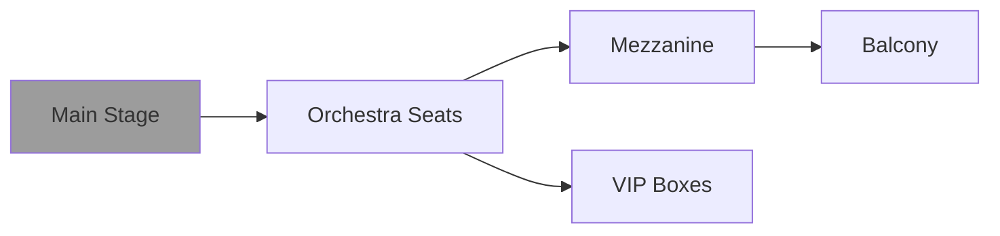

## Overview

Usupovo Life Hall delivers an immersive experience through its website, where you discover upcoming concerts, performances, and events. Navigate detailed schedules, interact with seating charts, access support channels, and enable notifications to never miss a show. These features help you plan visits efficiently and stay connected with the venue's vibrant calendar.

## Key Features

Explore the standout capabilities that make planning your visit seamless.

<Columns cols={2}>
  <Card title="Event Schedules" icon="calendar" href="#event-schedules">
    View comprehensive listings with dates, artists, and ticket availability.
  </Card>
  <Card title="Seating Charts" icon="map" href="#seating-charts">
    Interact with dynamic layouts to select the perfect seats.
  </Card>
  <Card title="Contact Support" icon="phone" href="#contact-channels">
    Reach out via multiple channels for assistance.
  </Card>
  <Card title="Notifications" icon="bell" href="#notifications">
    Get real-time updates on events and changes.
  </Card>
</Columns>

## Detailed Event Descriptions and Schedules

Access rich event information to make informed decisions. Each listing includes artist bios, set times, ticket prices, and accessibility details.

Follow these steps to explore an event:

<Steps>
  <Step title="Browse Events" icon="search">
    Visit the `https://usupovo-life-hall.example.com/events` page and filter by date or genre.
  </Step>
  <Step title="View Details" icon="eye">
    Click any event to see the full description, including opening acts and venue notes.
  </Step>
  <Step title="Check Schedule" icon="clock">
    Review the timeline table for doors open, show start, and intermissions.
  </Step>
</Steps>

| Event Detail       | Example Data                  |
|--------------------|-------------------------------|
| Artist             | Indie Rock Quartet            |
| Date & Time        | 2024-12-15, 8:00 PM           |
| Doors Open         | 7:00 PM                       |
| Ticket Price       | `{50-150}` (varies by seat)   |
| Duration           | 2.5 hours                     |

<Callout kind="tip">
  Pro tip: Use the search bar to find sold-out shows for waitlist options.
</Callout>

## Interactive Venue Seating Charts

Visualize the hall's layout with an interactive map. Zoom, pan, and hover over seats to check availability, prices, and views.



Embed this chart on your site using this code:

<CodeGroup tabs="HTML,JavaScript">
  ````html
  <iframe src="https://usupovo-life-hall.example.com/seating-chart?event=123" width="100%" height="600" frameborder="0"></iframe>
  ````

  ````javascript
  fetch('https://usupovo-life-hall.example.com/api/seating/123')
    .then(res => res.json())
    .then(data => renderChart(data.seats));
  ````
</CodeGroup>

## Contact and Support Channels

Connect with the team quickly through tailored options.

<Tabs>
  <Tab title="Email & Form" icon="mail">
    Submit inquiries via the contact form at `https://usupovo-life-hall.example.com/contact`.

    <ParamField path="subject" param-type="string" required="true">
      Query topic like "Ticket Refund".
    </ParamField>

    <ParamField body="message" param-type="string" required="true">
      Detailed description.
    </ParamField>
  </Tab>
  <Tab title="Phone & Chat" icon="phone">
    Call `{+1-555-123-4567}` during business hours (10 AM - 6 PM) or use live chat on the site.
  </Tab>
</Tabs>

## Stay Updated with Notifications

Enable alerts for new events, cancellations, or flash sales.

<ExpandableGroup>
  <Expandable title="Sign Up for Email Alerts" default-open="true">
    Enter your email on the homepage footer form. Confirm via the activation link sent to `{your-email@example.com}`.
  </Expandable>
  <Expandable title="Browser Notifications">
    Allow push notifications in your browser settings for instant updates.
  </Expandable>
</ExpandableGroup>

<Callout kind="success">
  Ready to attend? Check [events now](https://usupovo-life-hall.example.com/events).
</Callout>